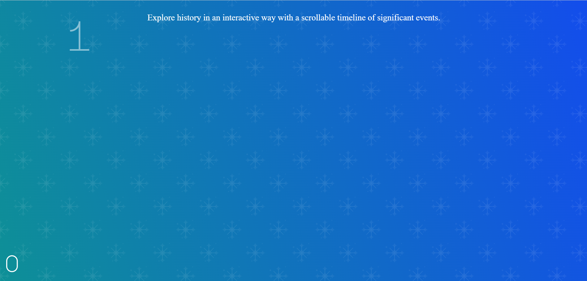
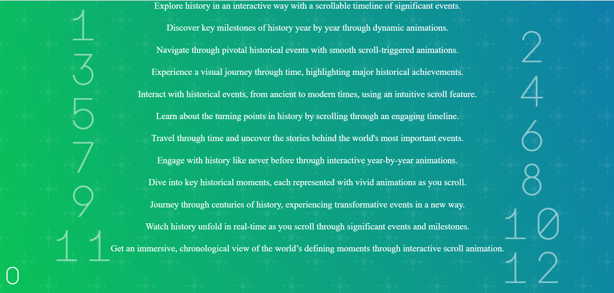

# Interactive History Timeline: A Scrollable Journey Through Key Events

<a href="https://www.linkedin.com/in/dharmendraverma95/" target="_blank">LinkedIn Profile </a>

<a href="https://www.behance.net/dhirukumar" target="_blank">Behance Profile </a>

## Overview

Introduction: The Interactive History Timeline is an engaging tool designed to take users on a visual and interactive journey through significant historical events. With a unique scroll animation feature, users can explore key moments in history year by year, immersing themselves in the milestones that have shaped our world.

Embark on a visual journey through history! Our interactive scroll pointer lets you explore key events from the past, year by year, with engaging animations.

### Features
<ul>
  <li>Provide an intuitive and visually stimulating way to explore history.
</li>
  <li>Allow users to gain a chronological understanding of historical events.
</li>
  <li>Offer educational value with clear, concise descriptions and animations.
</li>
<li>Mobile-Friendly: Fully responsive and works seamlessly on all screen sizes.
</li>
</ul>

# Preview

ScrollMotion: On-Scroll Animations 
 

 
 
 On-Scroll Timeline Animation Start & End Point 
 

 
###### Lang
<ul>
  <li>Graphic Design Software: Adobe Illustrator, Photoshop, Figma (for mockups)</li>
  <li>Web Tools (Optional): HTML, CSS for any digital presentations or landing pages</li>
  <li>Font Awesome (Optional for icons)</li>

</ul>

